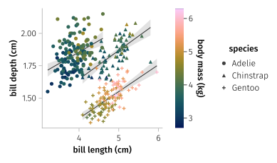

class: center, middle
# Data Analysis and Visualization with AlgebraOfGraphics
---

### Structure

- Introduction (from data to visualizations).
--
- The philosophy of AlgebraOfGraphics.
--
- The building blocks of AlgebraOfGraphics.
--
- Combining building blocks via algebraic operations.
--
- Defining visualizations graphically.

---

### From data to visualization

<p class="width-half">
  Representing data graphically is a ubiquitous problems. While a wide array of different visualizations exists, many plots follow a similar procedure.
</p>

--

<ol class="width-half float-left">
  <li>Group and process the data.</li>
  <li>Encode graphically
    <ul>
      <li>categorical variables (color palette, marker shape, line style, etc.),</li>
      <li>continuous quantities (x, y position, marker size, color gradient, etc.).</li>
    </ul>
  </li>
  <li>Select a plot type and theme some plot attributes.</li>
  <li>Finally, combine many such plots to generate a complex figure.</li>
</ol>

--



--

<p class="width-half float-right"><b>Key observation:</b> the two layers (scatter and lines) share a lot of information.</p>

---

### How does AlgebraOfGraphics work?

#### Building blocks

```@example
using AlgebraOfGraphics, CairoMakie # hide
using PalmerPenguins, DataFrames # hide
penguins = dropmissing(DataFrame(PalmerPenguins.load())) # hide
dataset = data(penguins) # tabular dataset
bill_encoding = mapping(
    :bill_length_mm => (t -> t / 10) => "bill length (cm)",
    :bill_depth_mm => (t -> t / 10) => "bill depth (cm)"
) # graphically encode bill size (converted to centimeters)
scatter_encoding = mapping(
    color = :body_mass_g => (t -> t / 1000) => "body mass (kg)",
    species = :species
) # mappings specific to the scatter plot
plottype = visual(Scatter)
scatter_layer = dataset * bill_encoding * scatter_encoding * plottype
draw(scatter_layer)
```